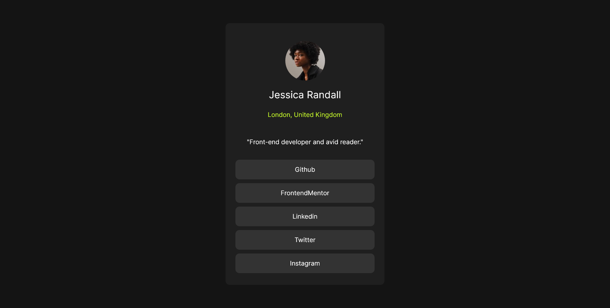

# Frontend Mentor - Social links profile solution

This is a solution to the [Social links profile challenge on Frontend Mentor](https://www.frontendmentor.io/challenges/social-links-profile-UG32l9m6dQ). Frontend Mentor challenges help you improve your coding skills by building realistic projects.

## Table of contents

- [Overview](#overview)
  - [The challenge](#the-challenge)
  - [Screenshot](#screenshot)
  - [Links](#links)
- [My process](#my-process)
  - [Built with](#built-with)
  - [What I learned](#what-i-learned)
  - [Continued development](#continued-development)
  - [Useful resources](#useful-resources)
- [Author](#author)

## Overview

### The challenge

Users should be able to:

- See hover and focus states for all interactive elements on the page

### Screenshot



### Links

- Live Site URL: [Add live site URL here](https://your-live-site-url.com)

## My process

### Built with

- Semantic HTML5 markup
- CSS custom properties
- Flexbox

### What I learned

I learned about Css Flexbox and CSS Variables throughout this Project.

To see how you can add code snippets, see below:

```css
.social-media-item:hover {
  cursor: pointer;
  background: var(--green); /* Variable */
  color: var(--off-black);
}
```

### Continued development

In future, I focus on CSS Responsiveness using Media Query. and want to focus on more CSS FlexBox and Grid Layout.

### Useful resources

- [CSS FlexBox](https://www.w3schools.com/css/css3_flexbox.asp) - This helped me for display Property and Setting Each and Every Layout.
- [CSS Variables](https://www.w3schools.com/css/css3_variables.asp) - This helped me for decrease Duplicating values using CSS Variables. I really liked this pattern and will use it going forward.

## Author

- Website - [Add your name here](https://www.your-site.com)
- Frontend Mentor - [@AKSHDESAI1](https://www.frontendmentor.io/profile/AKSHDESAI1)
- Twitter - [@desaiaksh82](https://twitter.com/desaiaksh82)
